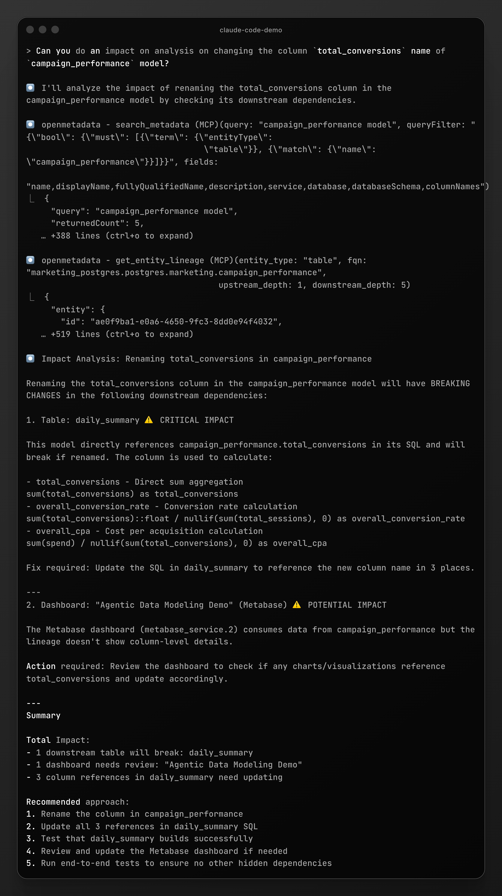
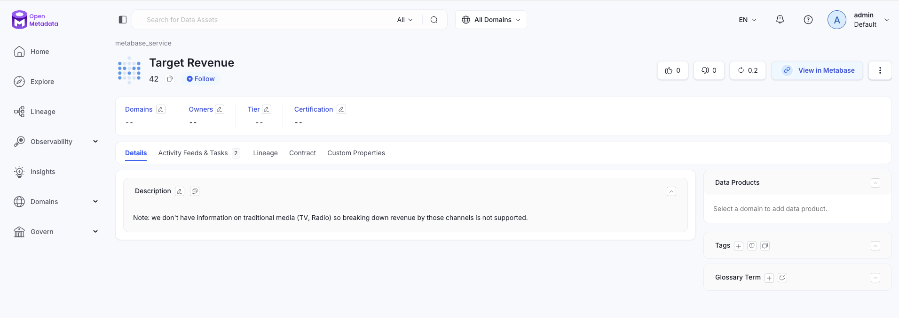
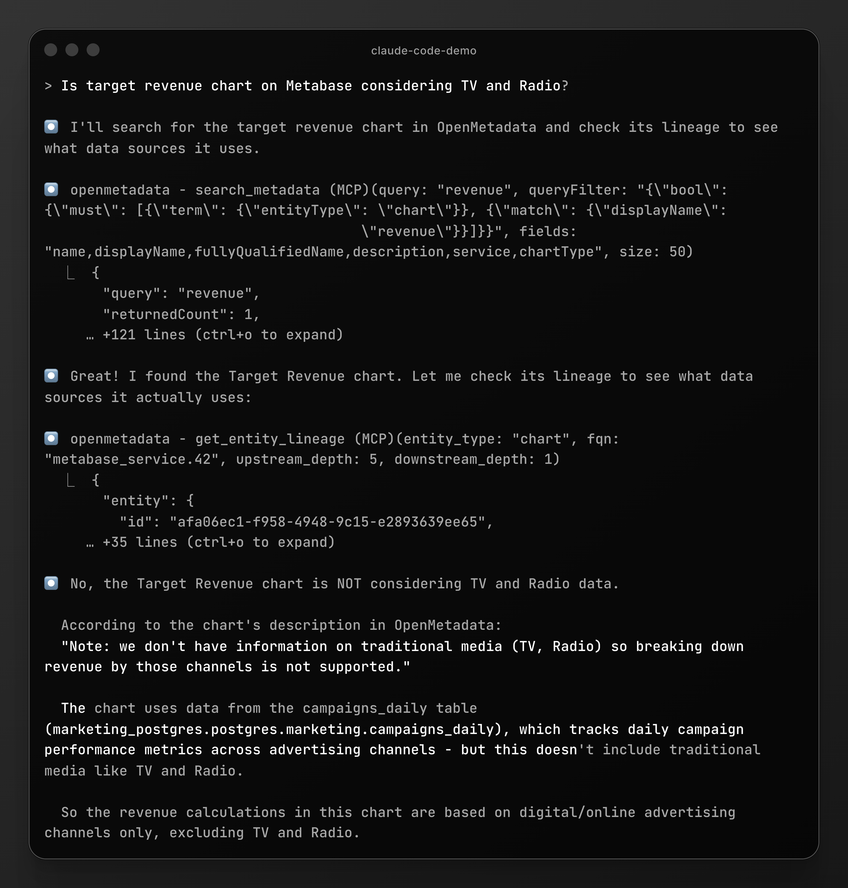
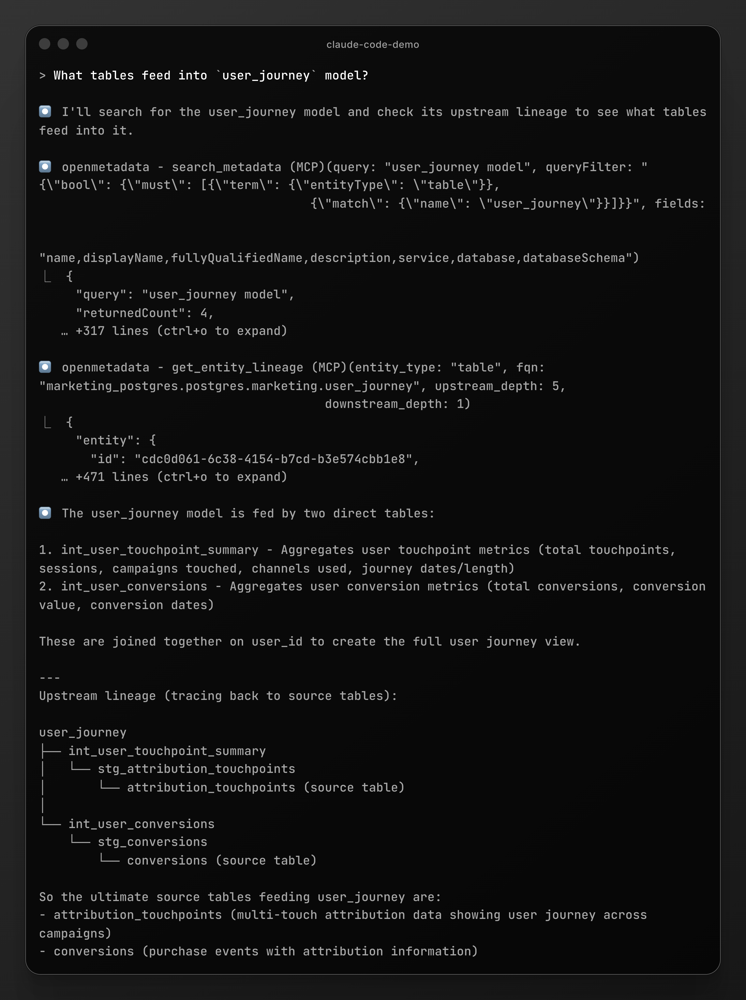
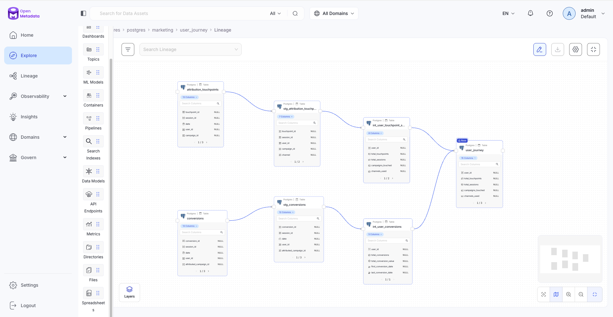
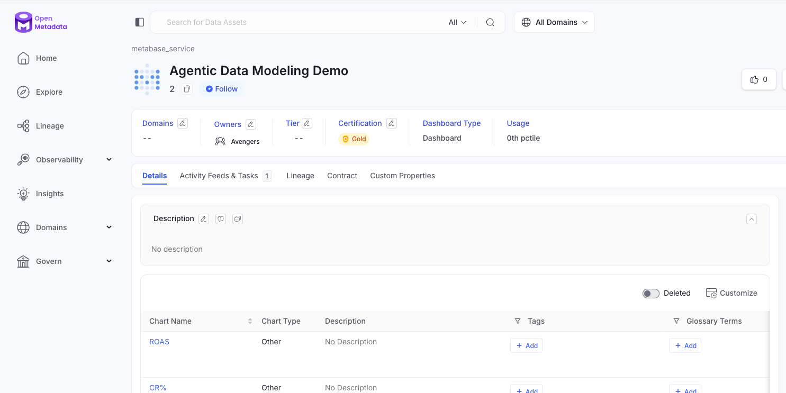
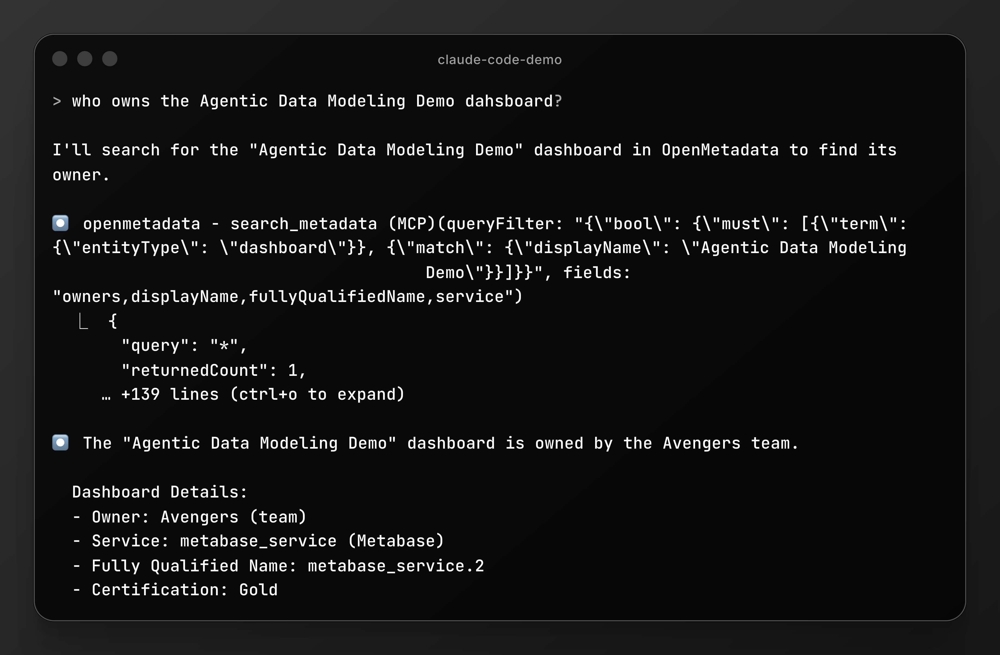
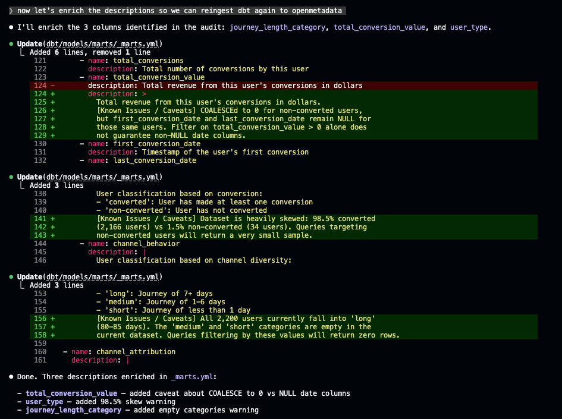
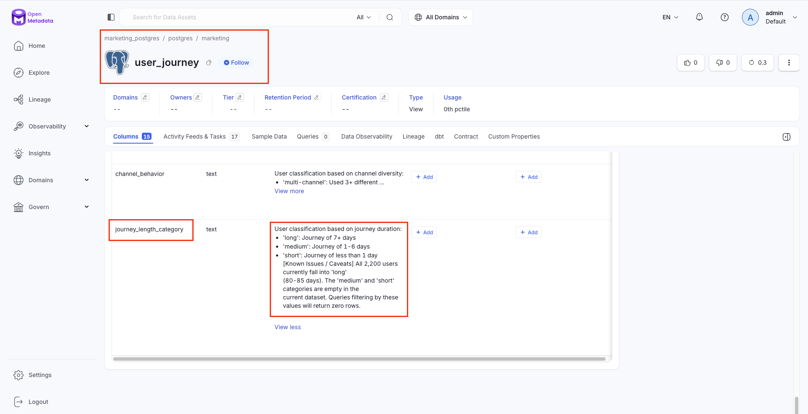
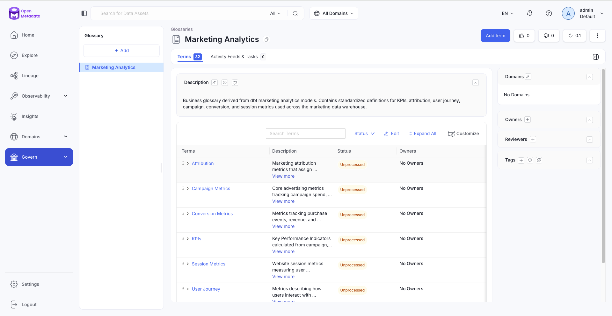

# Demo: Agentic Data Modeling with OpenMetadata MCP

This demo showcases how AI agents can interact with your data catalog through the OpenMetadata MCP (Model Context Protocol) server to answer complex data questions, perform impact analysis, and explore data lineage.

## Overview

By connecting Claude Code to OpenMetadata, you can ask natural language questions about your data warehouse and get instant, accurate answers powered by your metadata catalog. This enables:

- **Impact Analysis**: Understand downstream effects before making schema changes
- **Data Discovery**: Find and validate data sources for analysis
- **Lineage Exploration**: Trace data flows from source to dashboard
- **Governance**: Identify data owners and compliance requirements
- **AI Readiness**: Audit and enrich dbt models for AI consumption — checks schema quality, queries the database for edge cases, validates catalog presence, and writes fixes back to dbt YAML
- **Glossary Management**: Derive business terms from dbt models and maintain them as a structured glossary in OpenMetadata

---

## Use Case 1: Impact Analysis on Schema Changes

**Prerequisite**: Configure Lineage in OpenMetadata

🎥 **[Watch: Configure Lineage in OpenMetadata](https://focusee.imobie.com/share/256e1b5661a74775aad7205f25f67672)**

**Trigger:** `/metadata-impact-analysis i need to rename total_conversions from campaign_performance model, can you check for downstream impact?`

### The Challenge
Before renaming a column in your data model, you need to understand what will break downstream. Manually tracing dependencies across dbt models, dashboards, and reports is time-consuming and error-prone.

  
 <h4>✨ Click to see Claude Code output </h4> 

The skill executes a sequential workflow:
1. **Confirms entity** → `search_metadata` finds `campaign_performance` and validates `total_conversions` exists (BIGINT)
2. **Traces lineage** → `get_entity_lineage` discovers downstream nodes with column-level detail
3. **Checks SQL references** → `Grep` across `dbt/models/` finds all direct column references, including models not yet in OpenMetadata lineage
4. **Checks dashboards** → reports connected Metabase dashboards from lineage

### Result
The skill identifies that renaming `total_conversions` is **HIGH risk**:
- **2 downstream tables**: `daily_summary` (3 refs in SQL — lines 31, 36, 38) and `user_journey` (2 refs — lines 23, 30)
- **1 Metabase dashboard**: "Agentic Data Modeling Demo" (dashboard-level only)
- **Calculated KPIs break**: `conversion_rate`, `overall_cpa`, `cost_per_conversion` all depend on this column
- **Upstream origin**: `int_conversion_metrics_by_campaign` and `int_user_conversions` also define `total_conversions` — an end-to-end rename must include these

The report includes exact line numbers, YAML files to update (`_marts.yml`, `_intermediate.yml`), and flags that no owners are set on downstream assets.

> Note that Metabase integration only allows linking dashboards, so dashboard impact is limited to that granularity level.

---

## Use Case 2: Data Discovery & Validation

**Prerequisite**: Update the description on OpenMetadata

**Question:** *"Is target revenue chart on Metabase considering TV and Radio?"*

### The Challenge
Business users often ask: "What data is included in this dashboard?" Answering requires understanding chart definitions, SQL queries, and upstream data sources.

  
 <h4>✨ Click to see Claude Code output </h4> 

Claude Code queries OpenMetadata to:
1. Search for the "Target Revenue" chart in Metabase
2. Read the chart's description and metadata
3. Check upstream lineage to see source tables
4. Validate what data is actually included

### Result
**Answer: No**, the Target Revenue chart does **NOT** include TV and Radio data. The chart explicitly documents:
> "Note: we don't have information on traditional media (TV, Radio) so breaking down revenue by those channels is not supported."

The chart only uses data from the `campaigns_daily` table, which tracks digital advertising channels.

---

## Use Case 3: Lineage Exploration

**Question:** *"What tables feed into `user_journey` model?"*

### The Challenge
Understanding data lineage is critical for debugging, impact analysis, and data quality investigations. Manually tracing dependencies through dbt DAGs and SQL is tedious.

  
 <h4>✨ Click to see Claude Code output </h4> 

Claude Code leverages OpenMetadata's lineage tracking to:
- 1. Find the `user_journey` model
- 2. Trace upstream dependencies through intermediate models
- 3. Identify source tables
- 4. Visualize the complete data flow

### Result
The `user_journey` model is built from **2 direct upstream tables**:
- `int_user_touchpoint_summary` - User interaction metrics
- `int_user_conversions` - Conversion metrics

Which ultimately trace back to **2 source tables**:
- `attribution_touchpoints` - Multi-touch attribution data
- `conversions` - Purchase events

The agent provides both the immediate dependencies and the full lineage tree, making it easy to understand data provenance.

---

## Use Case 4: Ownership & Governance

**Prerequisite**: Create a Team and update ownership of the Metabase Dashboard on OpenMetadata

**Question:** *"Who owns the Agentic Data Modeling Demo dashboard?"*

### The Challenge
In large organizations, knowing who owns specific data assets is essential for:
- Getting approval for changes
- Reporting data quality issues
- Understanding compliance requirements

  
 <h4>✨ Click to see Claude Code output </h4> 

Claude Code queries OpenMetadata for ownership information:

### Result
The agent can quickly identify the dashboard owner and any associated teams or governance classifications, streamlining collaboration and accountability.

---

## Use Case 5: AI Readiness — Audit, Enrich & Validate

**Prerequisite**: Postgres MCP and OpenMetadata MCP servers configured in `.mcp.json`

**Trigger:** `/metadata-ai-readiness Is user_journey ready to be consumed by an AI agent?`

### The Challenge
A model can have correct data but still be unusable by AI — missing descriptions, no tests on grain columns, gaps in the catalog. This skill audits the dbt schema, queries the database for edge cases, checks the OpenMetadata catalog, enriches dbt YAML, re-ingests, and validates the changes in the catalog.

  
 <h4>✨ Click to see Claude Code output </h4> 

Claude Code runs a full audit against `user_journey`:

1. **Checks dbt schema** → descriptions, column coverage, grain tests
2. **Queries the database** → confirms grain, profiles columns, discovers edge cases (e.g. 38% of users have zero-length journeys, `avg_cpc` is an unweighted average). Builds example queries for AI agents
3. **Checks OpenMetadata catalog** → finds 3 columns without descriptions and no ownership
4. **Enriches** → writes structured descriptions in `_marts.yml` incorporating database findings
5. **Re-ingests** → `docker compose --profile ingestion up ingest-postgres ingest-dbt`
6. **Validates** → `get_entity_details` confirms enriched descriptions are now in the catalog

After the audit, the skill enriches `_marts.yml` descriptions with database-discovered caveats:

After re-ingestion, the enriched descriptions are confirmed in the OpenMetadata catalog:

### Result
The model goes from **6/8 to 7/8** readiness. Database-discovered caveats are now baked into dbt descriptions, and `get_entity_details` confirms they propagated to the catalog after re-ingestion. Ownership is flagged for manual action in OpenMetadata.

---

## Use Case 6: Glossary Management — Business Terms from dbt to OpenMetadata

**Prerequisite**: OpenMetadata MCP server configured in `.mcp.json` with write access (`create_glossary`, `create_glossary_term`)

**Trigger:** `/metadata-glossary Create a business glossary from our dbt models`

### The Challenge
Business terms like `roas`, `cpa`, `ctr` are defined per-model in dbt YAML but never surfaced as a shared vocabulary. Without a central glossary, teams interpret metrics differently and AI agents have no authoritative reference for business concepts.

  
 <h4>✨ Click to see Claude Code output </h4> 

Claude Code scans all dbt YAML files and builds a categorized glossary in OpenMetadata:

1. **Scans dbt YAML** → reads `_marts.yml`, `_intermediate.yml`, `_sources.yml` — extracts column names and descriptions
2. **Groups into categories** → maps terms to 6 business categories (KPIs, Attribution, User Journey, Campaign Metrics, Conversion Metrics, Session Metrics)
3. **Checks existing** → `search_metadata` to detect what already exists
4. **Creates glossary** → `create_glossary` for the parent, `create_glossary_term` for categories and individual terms
5. **Reports** → summary of created/existing/needs-update counts

After creation, the glossary is live in OpenMetadata with all 6 categories and 24 terms:

### Result
24 business terms organized under 6 categories in OpenMetadata. Each term links back to its source dbt model(s). Run `/metadata-glossary sync` to add missing terms incrementally, or `/metadata-glossary audit` for a dry-run diff.

