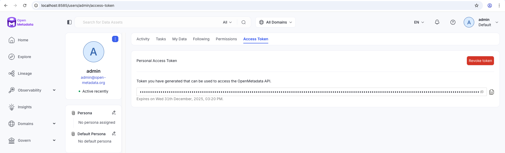
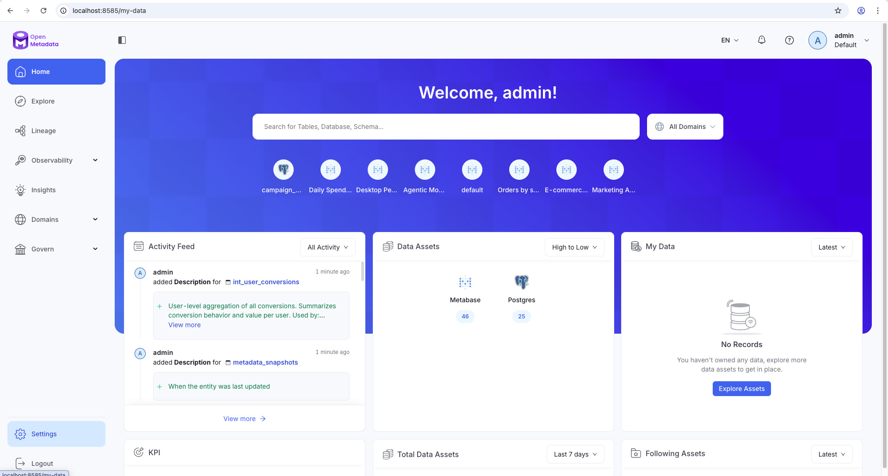
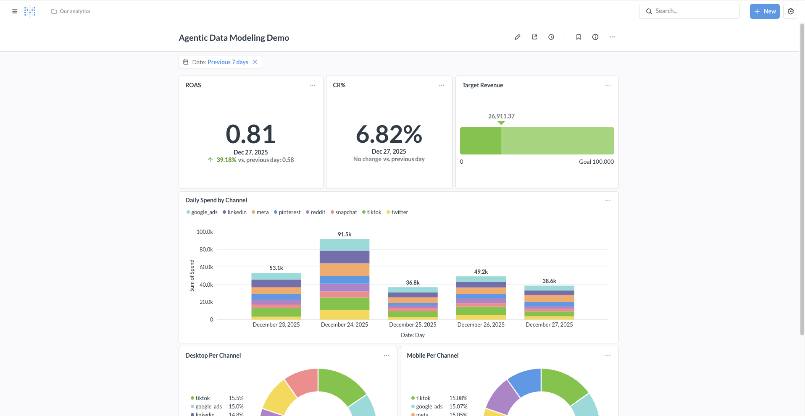

# ⚡ Quick Start

A step by step guide on how to get started with this project.

**Requirements:** Docker and Docker Compose

1. Run `cd openmetadata && cp .env.example .env` to get your credentials file ready, you will need it later:

```bash
# .env
OPENMETADATA_JWT_TOKEN=your_jwt_token_here
METABASE_USERNAME=your_metabase_username
METABASE_PASSWORD=your_metabase_password
```

2. Run the docker container:
```bash
docker compose up -d
```

This starts:
- PostgreSQL with 148K rows from S3
- dbt (17 analytics models)
- Metabase
- OpenMetadata

**Total:** 23 tables/views ready to query!

## 📊 Metabase Setup

1. Complete setup wizard to create your dummy user at `http://localhost:3000` (Continue with Sample Data)
2. Save your email and password on the `.env` variables `METABASE_USERNAME` and `METABASE_PASSWORD`

## 📥 OpenMetadata Ingestion

**1. Get JWT Token:**
- Login at `http://localhost:8585` using `admin@open-metadata.org` & `admin` as credentials
- Follow this `http://localhost:8585/users/admin/access-token` to create your Access Token
- Create token and save to on the `.env` variable `OPENMETADATA_JWT_TOKEN`:



**2. Run ingestion:**
```bash
docker compose --profile ingestion up ingest-postgres ingest-dbt ingest-metabase
```

**What gets ingested on `openmetadata/ingestion-configs/`:**
- **PostgreSQL**: Tables and schemas from `marketing` schema → creates `marketing_postgres` service
- **dbt**: Models and lineage → links to PostgreSQL service
- **Metabase**: Dashboards and charts → completes full lineage: tables → dbt → dashboards

You will see the PostgreSQL (dbt included) and Metabase assets available to explore:



To double check, visit the Metabase Dashboard [Agentic Data Modeling Demo Dashboard](http://localhost:3000/dashboard/2-agentic-data-modeling-demo) to verify everything works correctly:



## 🧠 MCP Server Configuration

This project uses two MCP servers configured in `.mcp.json`: **OpenMetadata** for catalog operations and **Postgres** for direct database queries.

### Postgres MCP (Google GenAI Toolbox)

Download the [GenAI Toolbox](https://googleapis.github.io/genai-toolbox/) binary for your platform:

```bash
# macOS ARM64 (Apple Silicon)
curl -o bin/toolbox https://storage.googleapis.com/genai-toolbox/v0.27.0/darwin/arm64/toolbox

# macOS Intel
curl -o bin/toolbox https://storage.googleapis.com/genai-toolbox/v0.27.0/darwin/amd64/toolbox

# Linux AMD64
curl -o bin/toolbox https://storage.googleapis.com/genai-toolbox/v0.27.0/linux/amd64/toolbox
```

```bash
chmod +x bin/toolbox
```

This gives Claude direct SQL access to the database via `list_tables` and `execute_sql` tools — used by the AI Readiness skill to profile columns, discover edge cases, and validate grain.

> **Docs**: [GenAI Toolbox — Postgres MCP Setup](https://googleapis.github.io/genai-toolbox/how-to/connect-ide/postgres_mcp/#configure-your-mcp-client)

### OpenMetadata MCP

Replace `<YOUR_OPENMETADATA_JWT_TOKEN>` in `.mcp.json` with the token you generated in the previous step.

> **Docs**: [OpenMetadata MCP Reference](https://docs.open-metadata.org/v1.10.x/how-to-guides/mcp/reference)

### Verify `.mcp.json`

Your `.mcp.json` should look like this (already included in the repo):

```json
{
  "mcpServers": {
    "postgres": {
      "command": "./bin/toolbox",
      "args": ["--prebuilt", "postgres", "--stdio"],
      "env": {
        "POSTGRES_HOST": "localhost",
        "POSTGRES_PORT": "5432",
        "POSTGRES_DATABASE": "postgres",
        "POSTGRES_USER": "postgres",
        "POSTGRES_PASSWORD": "password"
      }
    },
    "openmetadata": {
      "command": "npx",
      "args": [
        "-y", "mcp-remote",
        "http://localhost:8585/mcp",
        "--auth-server-url=http://localhost:8585/mcp",
        "--client-id=openmetadata",
        "--header", "Authorization:${AUTH_HEADER}"
      ],
      "env": {
        "AUTH_HEADER": "Bearer <YOUR_OPENMETADATA_JWT_TOKEN>"
      }
    }
  }
}
```

> For Cursor, this same config goes in `.cursor/mcp.json`.

Then use the MCP servers to ask questions such as:

- "Can you do an impact analysis on changing the column `total_conversions` name of `campaign_performance` model?"
- "Is target revenue chart on Metabase considering TV and Radio?"
- "What tables feed into `user_journey` model?"
- "Who owns the Agentic Data Modeling Demo dashboard?"
- "Is `user_journey` ready to be consumed by an AI agent?"
- "Create a business glossary from our dbt models"

---

## 📖 Next Steps

**See these use cases in action!** Check out the [**Demo Documentation**](DEMO.md) for detailed walkthroughs showing:

- **Impact Analysis** - Understand downstream effects before making schema changes
- **Data Discovery** - Validate data sources and understand what's included in dashboards
- **Lineage Exploration** - Trace data flows from source tables to final models
- **Ownership & Governance** - Find data asset owners and governance information
- **AI Readiness** - Audit, enrich, and validate dbt models for AI consumption
- **Glossary Management** - Derive business terms from dbt and maintain them in OpenMetadata

Each use case includes screenshots, explanations, and real examples from this project.