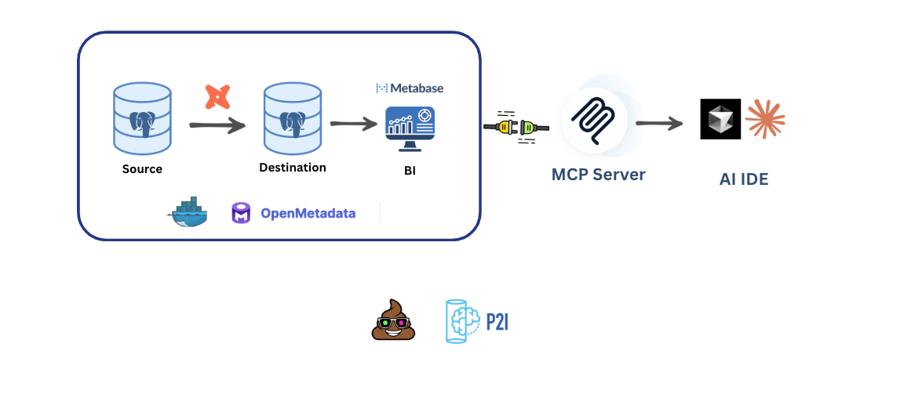

# 🤖 Agentic Data Modeling with OpenMetadata

A complete, self-contained data analytics stack that automatically:
- Seeds marketing data from S3 into local PostgreSQL
- Runs dbt transformations to create analytics models
- Configures Metabase with pre-loaded database connections and metadata
- Provides unified metadata management via OpenMetadata
- Enables AI-powered data exploration through Claude

## 🔗 Unified Metadata with OpenMetadata

**OpenMetadata** serves as a unified metadata platform that easily connects different parts of the data engineering cycle. It acts as a central hub to:
- Ingest metadata from data sources, transformation tools (dbt), and visualization layers
- Build end-to-end lineage showing data flow from source tables → dbt models → dashboards
- Centralize documentation, schemas, column descriptions, and relationships
- Track dependencies and understand the downstream impact of changes

This provides a complete view of our data ecosystem, enabling you to explore metadata, view lineage, and understand dependencies across all your data assets.

## 💬 End To End Data Modeling with Claude & OpenMetadata MCP Server

Once your data engineering components are connected to OpenMetadata, you can leverage the **Claude MCP (Model Context Protocol) Server** to interact with your metadata using natural language. This enables:

- **Natural Language Queries**: Ask questions about your data architecture in plain English, such as "What tables feed into the `campaign_performance` model?" or "Show me all dashboards that use user data"
- **Intelligent Exploration**: Discover relationships and dependencies without manually navigating through the UI
- **Documentation Assistance**: Get instant answers about column meanings, data types, and business context
- **Lineage Visualization**: Understand data flows through conversational queries rather than complex graph navigation
- **Impact Analysis**: Quickly identify what would be affected by changes to specific tables or models

The MCP server bridges the gap between your metadata and AI, making it accessible and queryable through natural language, dramatically reducing the time needed to understand and explore your data architecture.

## 🏗️ Project Architecture & Structure

- **Data Source**: PostgreSQL database
- **Transformation**: [dbt](https://www.getdbt.com/) for data modeling and transformation.
- **Visualisation**: [Metabase](https://www.metabase.com/) dashboards for business intelligence
- **Metadata Management**: [OpenMetadata](https://open-metadata.org/) to unify all metadata in one platform (hosted locally)
- **AI Integration**: OpenMetadata MCP Server to connect with Claude Code or Cursor and enable natural language queries



This setup enables a complete data analytics workflow where:
1. Raw data flows from PostgreSQL
2. dbt transforms and models the data locally
3. Metabase provides interactive dashboards
4. OpenMetadata centralizes metadata from all components via **YAML-based ingestion** (not UI), providing unified lineage and metadata views
5. Claude MCP Server allows AI-powered exploration and querying of the metadata through natural language

**Key Feature:** All OpenMetadata ingestion is configured through YAML files, enabling Infrastructure as Code (IaC) practices. Ingestion runs on-demand using Docker Compose profiles, giving you control over when metadata is synchronized. While OpenMetadata provides a UI for configuration, this project uses YAML files for version control, automation, and reproducibility.

```text
├── dbt/                            # dbt project
│   ├── models/         
│   ├── dbt_project.yml
│   └── profiles.yml                
├── images/                         # Architecture diagrams
│   └── architecture.png
├── openmetadata/
│   ├── docker-compose.yml          # Main orchestration file
│   └── ingestion-configs/          # YAML-based ingestion configs
├── seed/                           # Data seeding scripts
│   ├── Dockerfile
│   ├── requirements.txt
│   └── scripts/                    # Scripts to seed Postgres and Metabase
└── README.md
└── QUICKSTART.md
```
